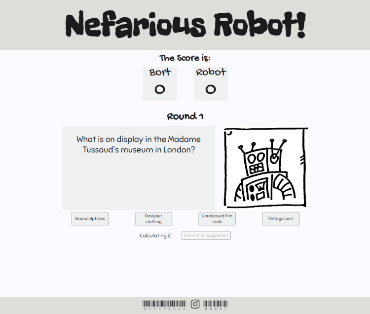

# Nefarious Robot

Nefarious Robot is a trivia game that pits the human user against a "robot" opponent played by the computer. 

The trivia game is up to eleven questions long, giving the human user and the computer one question each across five rounds. The game tracks and displays the score throughout the game. The game displays the the round as the game progresses. If at the end of five rounds the user has answered more questions correctly than the computer, the user wins. If the computer has answered more questions correctly, the robot wins. If there is a tie at the end of five rounds, there is a bonus round that gives only the user a question, a correct answer resulting in the user winning the game. 

[Nefarious Robot](https://wsmorrison.github.io/Robot_Quiz/) 
 
 
# Features and logic 

## Page Load
On page load, the game is covered with a mostly opaque cover. 
&emsp;-The cover explains the rules. 
 
 
&emsp;-The cover contains an input for the username, and a submission button. 
&emsp;&emsp;-Username input is validated to make sure the username is between one and six characters long. 
&emsp;&emsp;-If username is not present, or if it is too long, an alert is displayed. 
 
 
&emsp;&emsp;-If the username is accepted, the cover is removed. 
&emsp;&emsp;-Username is displayed in the score area for the duration of the game. 
&emsp;-This cover and username retrieval also gives JavaScript time to asynchronously retrieve the questions from the Open Trivia Database and display them. 

    
## Rounds of Play
At the beginning of the round, a question is displayed for the user. 
&emsp;-The image reflects that it is the user's turn. 
&emsp;-On larger screens, the position of the image is to the left of the question for the user. 
&emsp;-A question is retrieved from the object imported by the Open Trivia Database api. 
&emsp;-The four mulitple choice answers are displayed below the image and the question. 
&emsp;&emsp;-The answers, including the correct one, are displayed in random order. 
 
 
&emsp;&emsp;-When the user selects an answer by clicking on it, the answer button colors change. 
&emsp;&emsp;-If the user changes their mind and selects a different answer, the colors change to reflect the changed choice. 
&emsp;-The answer is submitted by clicking a button below the multiple choices answers. 
&emsp;&emsp;-If the user has not chosen an answer, an alert is displayed. 
&emsp;&emsp;-If an answer has been submitted, a cover is displayed over the answers. 
&emsp;&emsp;&emsp;-If the correct answer was selected, the cover indicates as much. 
&emsp;&emsp;&emsp;-If the incorrect answer was selected, the cover indicates the correct answer, and that the answer was wrong. 
&emsp;&emsp;&emsp;-The cover has a button to advance to the next question, and remove the cover. 
 
 
                
In the second half of the round, a question is displayed for the robot. 
&emsp;-The image reflects it is the robot's turn. 
&emsp;-On larger screens, the position of the image is to right of the question for the robot. 
&emsp;-A question is retrieved from the object imported by the Open Trivia Database api. 
&emsp;-The four multiple choice answers are displayed below the image and question. 
&emsp;&emsp;-The answers, including the correct one, are displayed in random order. 
&emsp;&emsp;-The answers are greyed out, and the answer buttons are disabled. 
&emsp;&emsp;-The submit button is greyed out and disabled at the start of the robot's turn. 
&emsp;&emsp;&emsp;-A timer counts down until the robot has "decided" on its answer. 
 
 
&emsp;&emsp;&emsp;-The submit button becomes active when the countdown completes. 
 
 
&emsp;&emsp;-If the user clicks the submit button, a cover is displayed over the answers. 
&emsp;&emsp;&emsp;-The cover displays whether the robot got the answer right or wrong. 
&emsp;&emsp;&emsp;&emsp;-The robot has an 80% chance of getting the question correct. 
&emsp;&emsp;&emsp;&emsp;-If the answer is right, the cover shows the right answer. 
&emsp;&emsp;&emsp;&emsp;-If the answer is wrong, the cover shows the wrong answer the robot "selected," and the right answer. 
&emsp;&emsp;&emsp;-The cover has a button to advance to the next question, and remove the cover. 

The score is updated after each question, according to whether the quesitons were answered correctly or not. 

## Winning or Losing    
The game decides if there is a winner or if a bonus question is required to decide the winner. 
&emsp;-At the end of five rounds, the game compares the scores. 
&emsp;-If the scores are the same, the game advances to a bonus question for the user only. 
&emsp;&emsp;-The bonus question is the same format as previous questions. 
&emsp;&emsp;-If the bonus question is answered correctly, the user wins. If the question is answered incorrectly, the robot wins. 
&emsp;-If the scores are different, the winner is calculated. 
&emsp;&emsp;-If the user score is higher, the user wins. 
&emsp;&emsp;&emsp;-The text in the question position indicates the user won. 
&emsp;&emsp;&emsp;-The image and text display in the correct orientation. 
&emsp;&emsp;-If the robot score is higher, the robot wins. 
&emsp;&emsp;&emsp;-The text in the question position indicates the robot won. 
&emsp;&emsp;&emsp;-The image and text display the correct orientation. 

    
When the game ends, a play-again cover appears and asks the user if they would like to play the game again. 
&emsp;-If the user selects yes, the scores are reset, the username conveys, and the game loads new questions. 
&emsp;-If the user selects no, the game opens a new tab to a Google search page. 

The footer contains a social media link to an Instagram account, where players can get to know their robot opponents. The link opens a new tab. 
 
 
# Testing

-Confirmed that the site is intuitive and works properly by having a handful of testers interact with the site on different devices, in different places, and with different use cases. 
-Confirmed that the wesbite works, looks good, and maintains clarity and functionality on different sized devices and at different sizes by using Chrome developer tools, as well as using the site on multiple devices. 
-Confirmed website is responsive, and works well on all devices, accounting for short as well as narrow screens.
 
 
-HTML passes through W3Schools validator without errors. 
-CSS passes through W3Schools validator without errors other than errors returned for using a CSS variable in an RGB field. 
-Javascript passes through JSHint validator with only "let" and "async function" JavaScript version suggestions, plus calling an unused function which is called in HTML. 
-Chrome developer tools Lighthouse scores are good. 
 
 

## Bug Fixes
-Game did not advance past the final screen. Troubleshooting found that the name of the div id="play-again" had been changed to "play-again-cover" for consistency in the HTML and CSS code, but not in JavaScropt. Corrected the error. 
-The footer was fixed at the bottom of thes screen which allowed the footer to cover the qustions and submission button on smaller screens. Solved this issue by adding a new div that included the whole site except the footer. This div's height is set to a minimum of the view height minus the height of the footer. This div then takes up no less than the full screen, minus the footer, which forces the footer to the bottom of a large screen, but allows all the elements to display properly if the screen is smaller. 
-Found a timing issue with the robot's turn which allowed the user to click "Submit for Judgement" before the countdown was complete. This effected the gameplay by disabling the user's answer buttons for the duration of the countdown time. Solution was to change the sequence in JavaScript that disabled the button, so that the button was disabled immediately when the player turn changed instead of one second into the function. 
-Found that on very small screens, the height of the answer-cover and play-again-cover divs made it impossible for the user to scroll down to advance the turn and round, or to choose to play again or choose not to at the end of the game. Used a max-height media query to keep all the buttons in the viewport on very small screens. 
-Found that on iPhones, the text in the answer buttons and "Submit for Judgement" buttons were blue and were not styled correctly. Troubleshooting found that the styling from the body styling CSS carried into Chrome but not Safari. Specified text styling for specific buttons resolved the issue. 

## Unfixed Bugs
-One tester indicated that during gameplay, the game advanced past the tiebreaker and allowed the robot to accrue more points that the max possible five. Though investigation has not reproduced this problem exactly, it was found that when the answer-cover or play-again-cover divs were displayed, if it were possible to click the "Submit for Judgement" button, the score would increase but the turn, round, and game would not. This issue was addressed by changing the size of the answer-cover and play-again-cover divs, and the problem has not recurred. 

## Deployment
-The page is deployed on Github pages using the following procedure: 
&emsp;-In the associated Github repository, navigated to settings tab. 
&emsp;-In the settings tab, navigated to the pages link in the lefthand navigation bar. 
&emsp;-Deployed the Master Branch as the source. 
&emsp;-Github provided the link to the completed website. 
-The deployed site can be found at this link: https://wsmorrison.github.io/Robot_Quiz/ 

## Forking and Cloning
-Using GitHub, the website can be cloned, or copied by forking. 
&emsp;-To clone the code, a user can navigate to the file menu in the GitHub, and select clone repository. Then they can select this repository and clone it to their own GitHub. 
&emsp;-To fork the document tree, a user will need to locate the repository for the website. In the repository, a user can click the fork button, and copy the repository to their own GitHub account. 

# Credits

-The Gitpod template was provided by Code Institute. 
-Many pieces of code are inspired by Code Institute training, W3 schools resources, Stack Overflow forums, and other searchable online resources. 
-The fonts used on this website are from Google Fonts. 
&emsp;-Freckle Face for the header, [Freckle Face](https://fonts.google.com/specimen/Freckle+Face?query=Freckle+Face) 
&emsp;-Gochi Hand for the section headings, [Gochi Hand](https://fonts.google.com/specimen/Gochi+Hand?query=Gochi+Hand) 
&emsp;-Sniglet for the text, [Sniglet](https://fonts.google.com/specimen/Sniglet?query=Sniglet) 
&emsp;-Libre Barcode 39 Text for the barcode in the footer, [Libre Barcode 39 Text](https://fonts.google.com/specimen/Libre+Barcode+39+Text?query=barcode) 
-Font-based logos for Instagram and emoji used in buttons are from Font Awesome. 
&emsp;-Instagram logo used in footer, [Instagram Logo](https://fontawesome.com/icons/instagram?f=brands) 
&emsp;-Happy face used in advance button after a correct user answer, [Smiley face](https://fontawesome.com/icons/face-smile?s=regular&f=classic) 
&emsp;-Sad face used in advance button after an incorrect user answer, [Sad face](https://fontawesome.com/icons/face-sad-tear?f=classic&s=regular) 
&emsp;-Impassive robot face used in advance button after any robot answer, [Robot face](https://fontawesome.com/icons/robot?s=solid&f=classic) 
-Readme.md image showing webpage across different devices from Am I Responsive?, [Am I Responsive](https://ui.dev/amiresponsive) 
-Readme.md image showing Google developer tools Lighthouse validator result is from Google Chrome browser. 
-Questions are from [Open Trivia Database](https://www.opentdb.com) 
-FavIcon is from Iconfinder.com, [Astronaut, Astronomy, Robot Icon](https://www.iconfinder.com/icons/2120162/astronaut_astronomy_robot_science_space_icon) 
-FavIcon code is from Code Institute, as described in the "Love Maths Walkthrough Project/Tidying Up/A Few Last Things..." lesson, [A Few Last Things...](https://learn codeinstitute.net/courses/course-v1:CodeInstitute+LM101+2021_T1/courseware/2d651bf3f23e48aeb9b9218871912b2e/04d7bdb98119413991e2a31e9a291970/) 
-Images were created by developer. 
 
This website is for educational puroses only. 